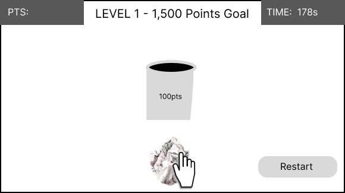
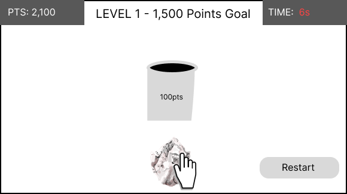

# Vision Statement - Physics Based Game "Throw it in!"

_Last updated April, 2023._

_Authors: Gamma Group_

## Table of Contents

- [General Concept](#general-concept)
- [Gameplay](#gameplay)
- [Reward System](#reward-system)
- [End Goal](#end-goal)
- [Initial Concept Images](#initial-concept-images)
- [More Recent Concept Images](#more-recent-concept-images)

## General Concept

This physics-based game allows a user with a few spare minutes of time to exercise their judgment and confirm their expectations about how an object with various sizes, shapes, and weights will interact with the environment. By attempting to throw the object with the goal of having it land in a receptacle a given distance from the throw point, they will learn how a small bouncy ball flies through the air versus a 12-pound bowling ball. Users can test their skills in a time-bound environment, seeing how many points they can score within a certain amount of time. They can only move on to the next object and/or environment as they score enough points.

## Gameplay

The application will give the user the capability to select their object, how far they want to throw it, and what they want to throw it at. Changing any of these attributes will change the difficulty of the throw, and change what the user learns about physics. For example, a golf ball with its dimpled surface will fly differently than a loosely-crumpled piece of paper with its exposed edges creating excess drag. The game consists of multiple levels, each with its own set of objects to throw, receptacles to aim for, and challenges. To progress to the next level, the user must score a minimum number of points within a set amount of time. The level progression is optional, and a player may replay the same level as often as they would like to try to get a high score.

## Reward System

Points achieved by throwing the object at a specified distance and landing it in the receptacle can be used to unlock new objects, new environments, and new receptacles. The user can gain bonus items, such as point multipliers and extra time for exceptional performance in each level.

## End Goal

When the app is fully developed, it will change the world by encouraging users to be more educated about how things they experience every day actually work, from the spinning of the wheels keeping their bicycle upright to the way clouds form and how the wind blows. It is the developers' goal to trigger the curiosity inside everyone's mind to facilitate a wiser and safer community. More realistically, the app will provide a fun way to get really good at useless virtual skills, wasting time in the process. It will provide an escape from whatever boredom the user has, if only for a little while.

## Initial Concept Images

**Start page**  

**Begin practice**  
  
  

**Practice ended, return to start page**  

**Begin first level**  
  
  
  
  

**Time expired, End Level**  

## More Recent Concept Images

**Full UI Sketch**

**Mouse Boundary UI**

